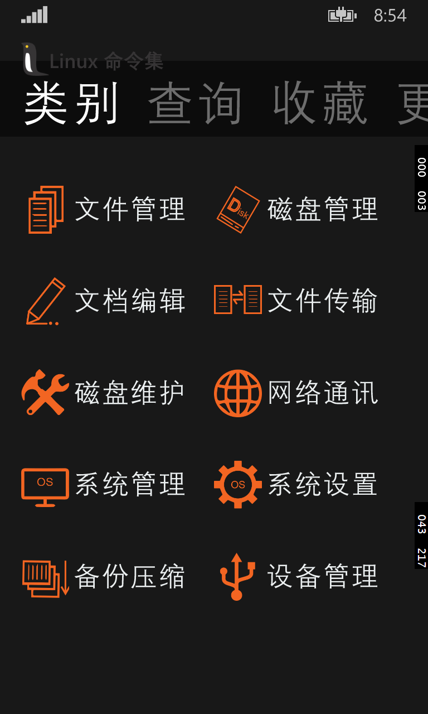
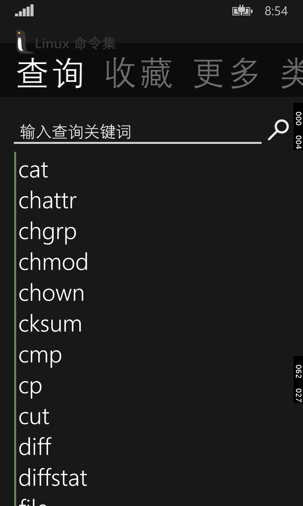
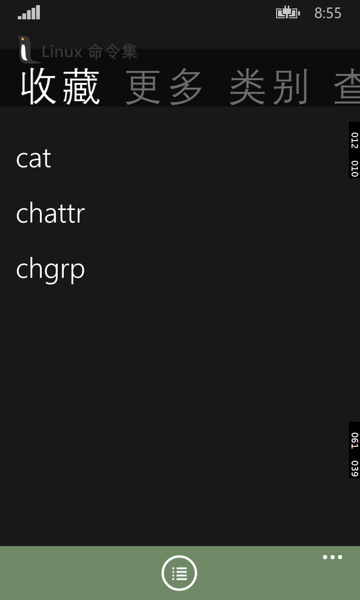
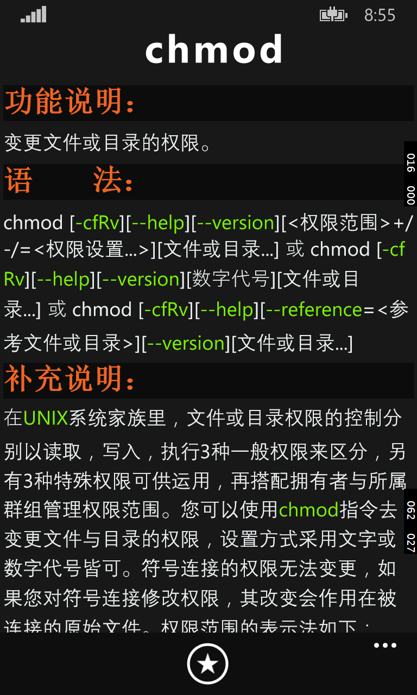

# Linux命令集

提供常用Linux命令的使用方法，支持Linux命令的查询（可只输入部分命令名），收藏，分类浏览。对使用方法中的参数进行高亮处理，提高阅读体验，欢迎下载、反馈、建议。截至2015.5.5此app主要功能已经完成，所以以后不会有大改动，主要根据反馈来更新小细节上的不足、完善体验；欢迎通过app内的反馈发邮件附上bug的详细描述。

应用的UI、代码由本人完成，资料源于互联网。

[微软官方应用市场下载](https://www.microsoft.com/en-us/store/p/linux%e5%91%bd%e4%bb%a4%e9%9b%86/9nblggh3m5rw/)

<figure class="half">
  
  
</figure>

<figure class="half">
  
  
</figure>